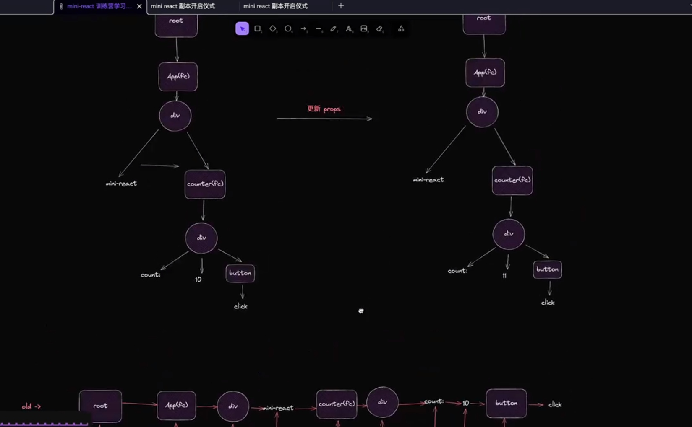

# mini-React
### 实现dom 与 虚拟dom

### filer优化递归dom

关键 使用了 requestIdleCallback 优化递归dom 减少大组件的情况下由于递归导致浏览器卡顿的问题 

1. 将虚拟dom树 变成链表 
// 
performWorkofUnit 方法 
1.创建dom  
2.创建dom 的属性  
3.变成链表   
4.返回内容
  
2. wookloop
循环调用requestIdleCallback

### 实现统一提交
 1. 为啥要实现统一提交？    
    为了避免空余时长不足的情况下，可能会导致浏览器只渲染了一部分dom  
    commitRoot   commitWork 方法

### 实现function  componenets
    undateFunctionCompoent
    undateHostComponent

 ### 实现事件绑定 
 
 ### 实现props 更新
 

 删除就节点
 delet
 commitDeletion

  实现组件组件级别的更新而不是全局更新  
  如何实现？  
  1. 找到需要更新的节点  
  2. 找到结束的节点

                                                                                                                                                                                                                                                                                                                                                                                                                                                                                                                                                                                                                                                                                                                                                                                                                                                                                                                                                                                                                                                                                                                                                                                                                                                                                                                                                                                                                                                                                                                                                                                                                                                                                                                                                                                                                                                                                                                                                                                                                                                                                                                                                                                                                                                                                                                                                                                                                                                                                                                                                                                                                                                                                                                                                                                                                                                                                                                                                                                                                                                                                                                                                                                                          